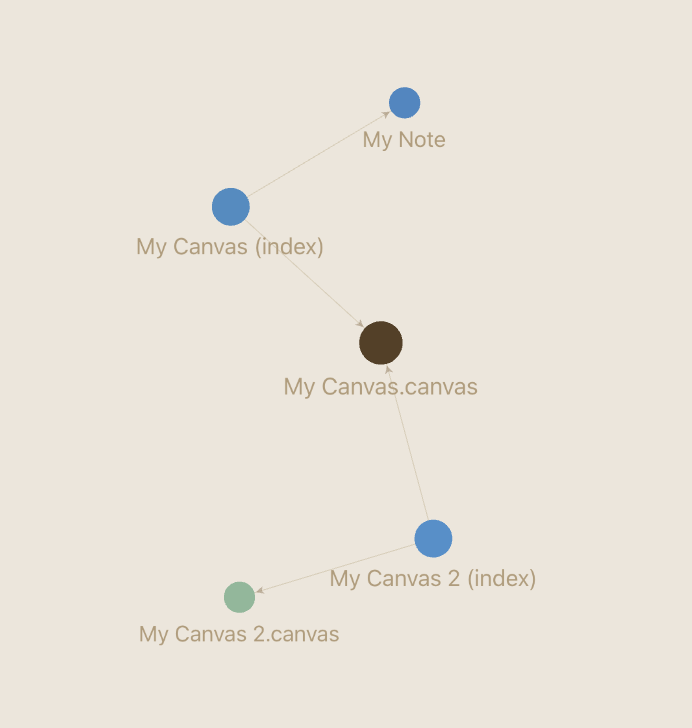

# Canvas to Markdown Indexer

This plugin enhances Obsidian's ability to manage Canvas files by creating index files in Markdown format. This ensures that Canvas files and their connections are properly represented in graph views and are accessible to Obsidian plugins that primarily work with Markdown files.

## Key Features

* **Improves Canvas Visibility:** Makes outgoing links from Canvas files visible in Obsidian's graph view, just like Markdown notes (Requires enabling "Show attachments" in graph view settings).
* **Enables Backlinks and Outgoing Links for Canvases:** Allows you to see Canvas files in both outgoing and backlinks panels, treating them more like standard notes.
* **Plugin Compatibility:** Makes Canvas files accessible to other Obsidian plugins that are designed to work with Markdown files, expanding the ecosystem of tools you can use with your canvases.
* **Automatic Synchronization:** Automatically creates and updates Markdown index files for your Canvas files. Changes in the Canvas are reflected in the Markdown file, and deleting a Canvas file also removes its corresponding Markdown index file.
* **AI Chat Compatibility:** Allows AI chat plugins (which typically only understand Markdown) to access and understand the content of your Canvas files through the generated index files.
* **Backup and Conversion:** The plugin can be used as a mechanism to backup Canvas files in a text-based format or to convert Canvases to Markdown notes (Remember to move the generated Markdown file out of the index folder to prevent accidental deletion if the original Canvas is removed).
* **Enhanced Compatibility with other Plugins:** Works particularly well with plugins like Smart Connections and Copilot, which can now leverage Canvas files more effectively.

## How it Works

This plugin automatically generates a Markdown file for each of your Canvas files. This Markdown file resides in a designated index folder and contains the content of the associated Canvas.

**In essence, the plugin:**

* Adds a new MD file for every Canvas file in your vault.
* Keeps the content of the Markdown file synchronized with the Canvas file.
* Stores all index files in a single, configurable folder.
* Operates automatically in the background, requiring no manual intervention for synchronization.

## Example

The images below illustrate how this plugin improves the visibility of Canvas files in the Obsidian graph view.

**Before using the plugin:** Canvas files are isolated in the graph and do not show connections to other notes.

**After using the plugin:** Canvas files are properly integrated into your graph, showing connections and making them first-class citizens in your knowledge graph.

## Planned Features

* **Indexing other Attachment Types:** Future versions may include indexing for other attachment file types like images, PDFs, audio files, etc. This would make these files searchable using Obsidian's built-in search.

## Use Cases - Unleash the Power of Canvas Files

This plugin helps you to use Canvas files as полноценными (full-fledged) notes within Obsidian, making them first-class citizens in your knowledge graph and workflow.

Perhaps there are even more use cases for this plugin that we haven't even imagined yet!

## Installation

1. **Install the "Canvas to Markdown Indexer" plugin** from Obsidian's community plugin browser.
2. **Enable the plugin** in your Obsidian settings under "Community plugins".
3. **(Optional) Configure the index folder location** in the plugin settings. By default, it will create a folder named "index" in your vault root.

Enjoy using your Canvas files more effectively within Obsidian!

---

**Disclaimer:** This plugin is provided as is, and while it aims to enhance your Obsidian experience, always ensure you have backups of your important data.
